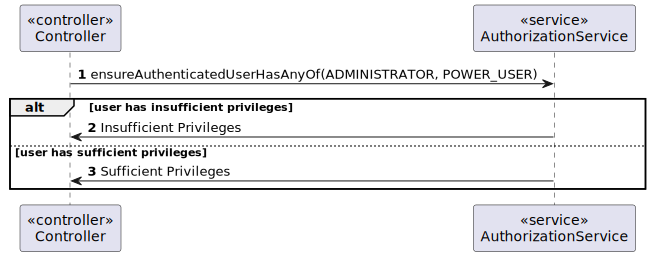

## Context

This document represents the sequence diagram operation of getting authorization.

Every controller performs this operation.

It is meaningful to know that if the authorization service verifies that there isn't sufficient permissions, the operation won't continue.

### Representation

