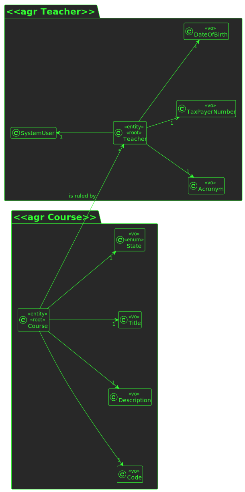
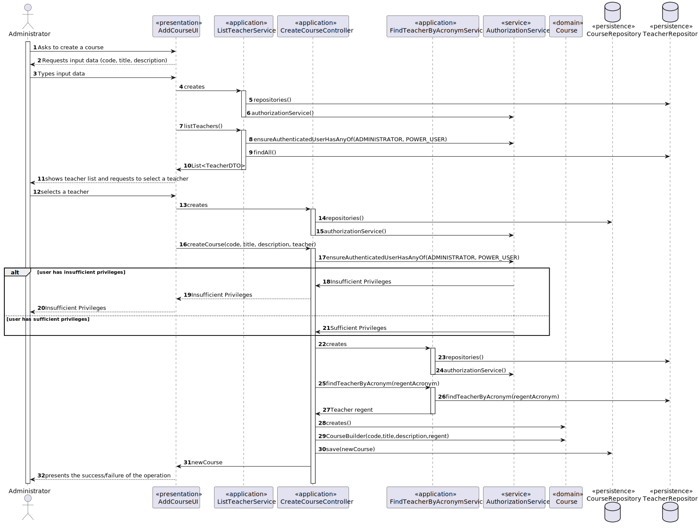
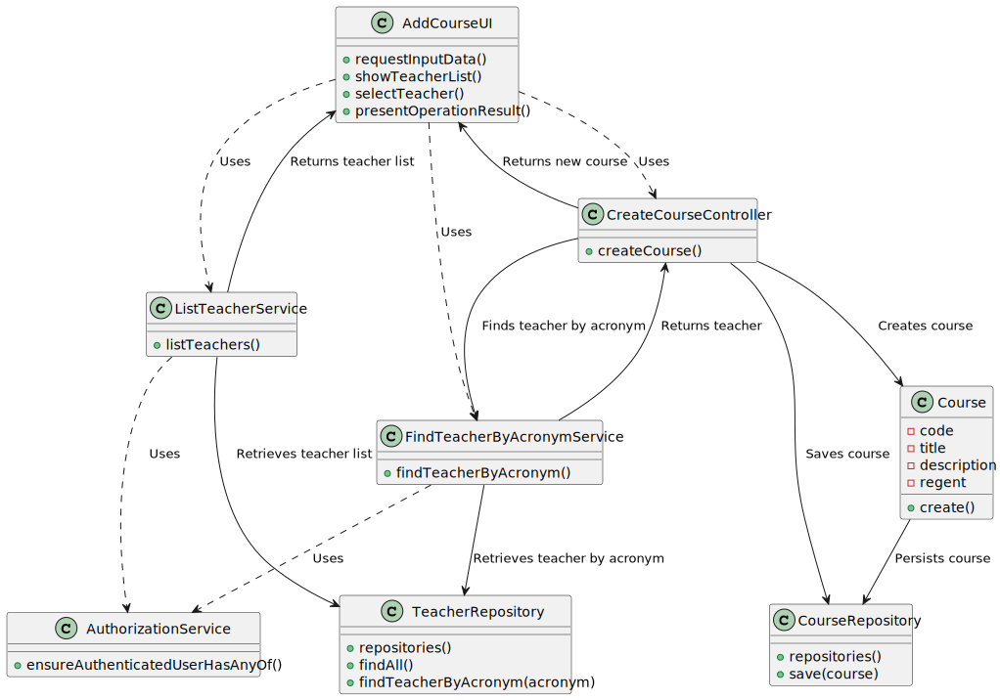

# US 1002

## 1. Requirements

**US1002** -  As Manager, I want to create courses

**Acceptance Criteria** - Different editions of a course are to be considered different courses (e.g., Intro-Math-Sem01, Intro-Math-Sem02). Only managers are able to execute this functionality.

## 2. Analysis

### 2.1 Identifying problem
In order to implement this functionality it is necessary to:

* Provide the manager with an interface to create the course
* Manager type the requested data for the system
* The system must show a list of teachers, to make sure the manager choose a responsible for that course

### 2.2 Domain Excerpt

### 2.3 Unit tests - Business Rules Testing

**Test 1:** *Ensure courseCode can't be null*

**Test 2:** *Ensure courseTitle can't be null*

**Test 3:** *Ensure courseDescription can't be null*

**Test 4:** *Ensure courseState can't be null*

**Test 5:** *Ensure courseRegent can't be null*

## 3. Design

To solve this problem it is necessary to ask the manager the parameters for the course (code, title, description, state)

After this inputs, the system must show a list of teachers, that will retrieve from the TeacherRepository, and the manager will choose one of them to be the regent

Finally, we send the data for the correspondent controller, which will after save into the CourseRepository the new object and persist it

### 3.1. Realization

* **Sequence Diagram**

* **Class Diagram**

### 3.2. Applied Patterns
The applied patters are:
* DTO;
* Persistence;
* Application;
* Controller;
* Service;
* Domain;
* UI;