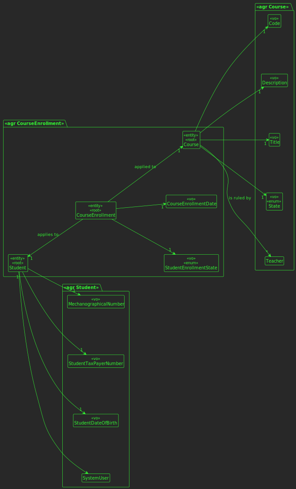
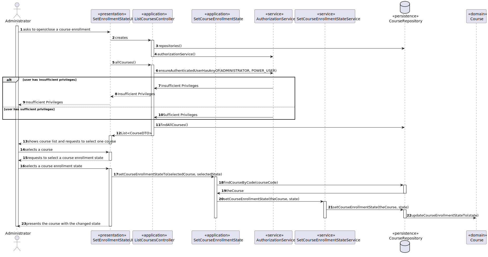
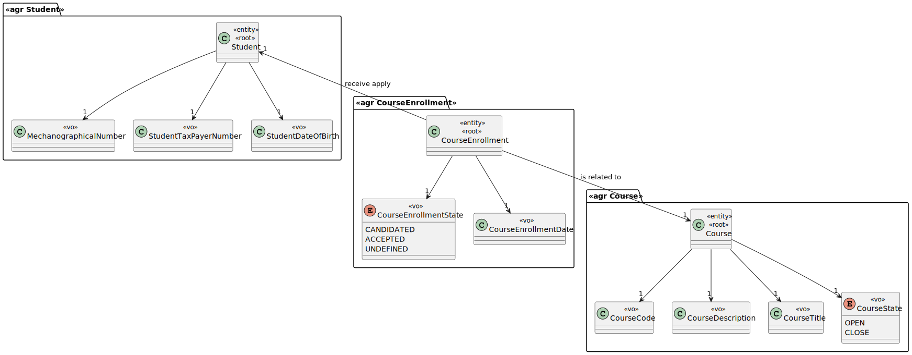
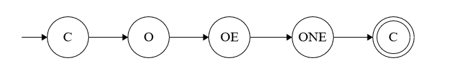

# US 1003

## 1. Context

This is a new task to do and is an important one.

## 2. Requirements

**US1003** As Manager, I want to open and close enrollments in courses.

## 3. Analysis

### 3.1 Domain Excerpt


## 4. Design

*In this sections, the team should present the solution design that was adopted to solve the requirement. This should include, at least, a diagram of the realization of the functionality (e.g., sequence diagram), a class diagram (presenting the classes that support the functionality), the identification and rational behind the applied design patterns and the specification of the main tests used to validade the functionality.*

### 4.1. Realization


### 4.2. Class Diagram



### 4.3. Machine State

This is a machine state that explains the usual workflow related to the course, where:
 - C -> Closed;
 - O -> Opened;
 - OE -> Open with enrollments;
 - ONE -> Open without enrollments.



Regarding this machine state, it is possible to conclude that is mandatory passing from "C" to "O" and for instance, from "C" it's not possible to "OE" passing "O".

### 4.4. Applied Patterns
The applied patterns are:
 - DTO;
 - Service;
 - Controller;
 - Repository;
 - Domain.

### 4.5. Tests

**Test 1:** *Verifies that it is not possible to follow other workflow else than the referenced in the machine state.*

```
@Test
    public void ensureCourseWorkFlowComply(){
        Course c1 = new Course("JAVA", "Java Collections Framework",
                "Java Collections Framework", CourseState.CLOSE, new Teacher("AMS",
                "21321312", LocalDate.of(1990,12,3), null));

        Assertions.assertThrows(IllegalArgumentException.class, c1::openCourseWithoutEnrollments);
        Assertions.assertThrows(IllegalArgumentException.class, c1::openCourseWithEnrollments);
        Assertions.assertThrows(IllegalArgumentException.class, c1::closeCourse);

        c1.openCourse();

        Assertions.assertThrows(IllegalArgumentException.class, c1::closeCourse);
        Assertions.assertThrows(IllegalArgumentException.class, c1::openCourse);
        Assertions.assertThrows(IllegalArgumentException.class, c1::openCourseWithoutEnrollments);

        c1.openCourseWithEnrollments();

        Assertions.assertThrows(IllegalArgumentException.class, c1::closeCourse);
        Assertions.assertThrows(IllegalArgumentException.class, c1::openCourse);
        Assertions.assertThrows(IllegalArgumentException.class, c1::openCourseWithEnrollments);

        c1.openCourseWithoutEnrollments();

        Assertions.assertThrows(IllegalArgumentException.class, c1::openCourse);
        Assertions.assertThrows(IllegalArgumentException.class, c1::openCourseWithEnrollments);
        Assertions.assertThrows(IllegalArgumentException.class, c1::openCourseWithoutEnrollments);

        c1.closeCourse();
    }
```

## 5. Implementation

## SetCourseEnrollmentStateControllerImpl.java
```
@Override
    public CourseDTO setCourseEnrollmentStateTo(String courseCode, CourseState state) {
        authz.ensureAuthenticatedUserHasAnyOf(ElearningRoles.ADMINISTRATOR,ElearningRoles.POWER_USER);
        Course theCourse = courseRepo.findCourseByCode(courseCode);
        service.setCourseEnrollmentState(theCourse, state);
        return theCourse.toDTO();
    }
```

## JpaCourseRepository.java
```
@Override
    public Course findCourseByCode(String courseCode) {
        final TypedQuery<Course> query = entityManager().createQuery("SELECT a FROM Course a WHERE upper(a.courseCode)" +
                " = upper(:course)", Course.class);
        query.setParameter("course", courseCode);
        return query.getSingleResult();
    }
```

## SetCourseEnrollmentStateService.java
```
	public Course setCourseEnrollmentState(Course course, CourseState state) {
        authz.ensureAuthenticatedUserHasAnyOf(ElearningRoles.ADMINISTRATOR, ElearningRoles.POWER_USER);
        courseRepo.updateCourseEnrollmentState(course, state);
        return course;
    }
```


## 6. Integration/Demonstration

*In this section the team should describe the efforts realized in order to integrate this functionality with the other parts/components of the system*

*It is also important to explain any scripts or instructions required to execute an demonstrate this functionality*

## 7. Observations

*This section should be used to include any content that does not fit any of the previous sections.*

*The team should present here, for instance, a critical prespective on the developed work including the analysis of alternative solutioons or related works*

*The team should include in this section statements/references regarding third party works that were used in the development this work.*
