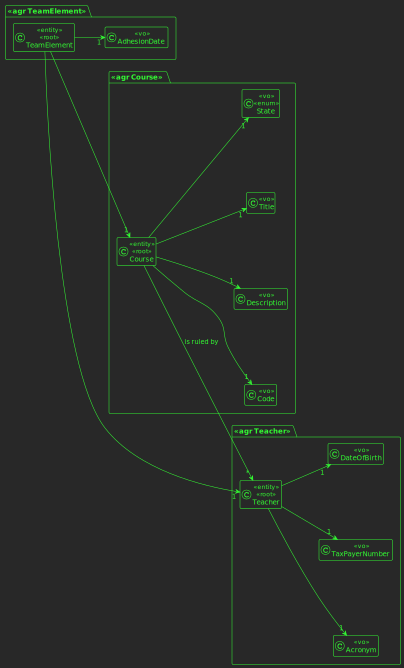
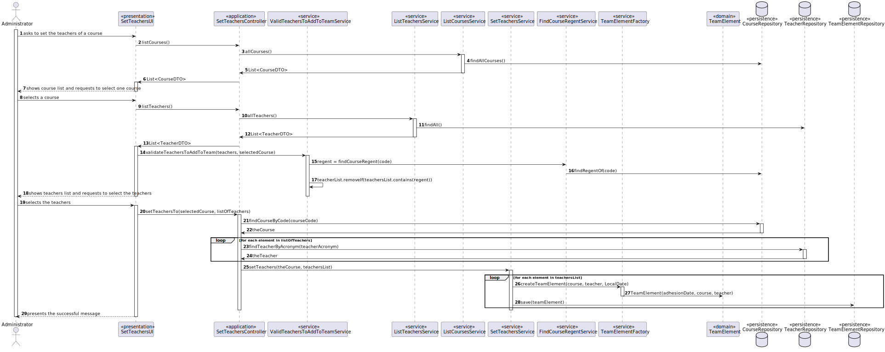

# US 1005

## 1. Context

This is a new task to do and is an important one.

## 2. Requirements

**US1005** As Manager, I want to set the teachers of a course

## 3. Analysis

### 3.1 Domain Excerpt


## 4. Design

*In this sections, the team should present the solution design that was adopted to solve the requirement. This should include, at least, a diagram of the realization of the functionality (e.g., sequence diagram), a class diagram (presenting the classes that support the functionality), the identification and rational behind the applied design patterns and the specification of the main tests used to validade the functionality.*

### 4.1. Realization


### 4.2. Class Diagram


### 4.3. Applied Patterns
The applied patterns are:
- DTO;
- Service;
- Controller;
- Service;
- Factory;
- Repository;
- Domain.

### 4.4. Tests
**Test 1:** *Verifies that it is not possible to follow other workflow else than the referenced in the machine state.*

```
@Test
    @BeforeEach
    void setUp() {
        adhesionDate = LocalDate.of(2023,12,12);
        teacher = new Teacher("AMS", "21321312", LocalDate.of(1990,12, 3), null);
        course = new Course("JAVA", "Java Collections Framework", "Java Collections Framework", CourseState.CLOSE, teacher);
    }

    @Test
    public void ensureTeamElementAdhesionDateCantBeNull(){
        Assertions.assertThrows(IllegalArgumentException.class, () ->
                new TeamElement(null, course, teacher));
    }
    @Test
    public void ensureTeamElementCourseCantBeNull(){
        Assertions.assertThrows(IllegalArgumentException.class, () ->
                new TeamElement(adhesionDate, null, teacher));
    }
    @Test
    public void ensureTeamElementTeacherCantBeNull(){
        Assertions.assertThrows(IllegalArgumentException.class, () ->
                new TeamElement(adhesionDate, course, null));
    }
```

## 5. Implementation

## SetTeachersControllerImpl.java
```
@Override
    public CourseDTO setTeachersTo(String courseCode, Set<TeacherDTO> teachers) {
        authz.ensureAuthenticatedUserHasAnyOf(ElearningRoles.ADMINISTRATOR,ElearningRoles.POWER_USER);
        Set<Teacher> teachersList = new HashSet<>();
        Course theCourse = courseRepo.findCourseByCode(courseCode);

        for (TeacherDTO t : teachers) {
            teachersList.add(teacherRepo.findTeacherByAcronym(t.getAcronym()));
        }

        service.setTeachers(theCourse, teachersList);
        return theCourse.toDTO();
    }
```

## JpaCourseRepository.java
```
 @Override
    public Iterable<Course> listAllCourses() {
        final TypedQuery<Course> query = entityManager().createQuery("SELECT a FROM Course a", Course.class);
        return query.getResultList();
    }
```

## SetTeachersService.java
```
	public Course setTeachers(Course course, Set<Teacher> teachers) {
        authz.ensureAuthenticatedUserHasAnyOf(ElearningRoles.ADMINISTRATOR, ElearningRoles.POWER_USER);
        for(Teacher teacher : teachers) {
            TeamElement teamElement = TeamElementFactory.createTeamElement(course, teacher, LocalDate.now());
            teamElementRepo.save(teamElement);
        }
        return course;
    }
```


## 6. Integration/Demonstration

*In this section the team should describe the efforts realized in order to integrate this functionality with the other parts/components of the system*

*It is also important to explain any scripts or instructions required to execute an demonstrate this functionality*

## 7. Observations

*This section should be used to include any content that does not fit any of the previous sections.*

*The team should present here, for instance, a critical prespective on the developed work including the analysis of alternative solutioons or related works*

*The team should include in this section statements/references regarding third party works that were used in the development this work.*
