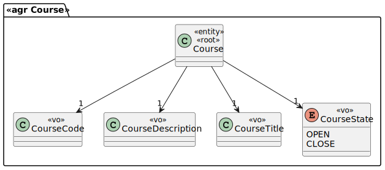

# US 1006

## 1. Context

This is a new task to do and is an important one.

## 2. Requirements

**US1006** As User, I want to list all the courses that are available to me

## 3. Analysis

### 3.1 Domain Excerpt


## 4. Design

*In this sections, the team should present the solution design that was adopted to solve the requirement. This should include, at least, a diagram of the realization of the functionality (e.g., sequence diagram), a class diagram (presenting the classes that support the functionality), the identification and rational behind the applied design patterns and the specification of the main tests used to validade the functionality.*

### 4.1. Realization


### 4.2. Class Diagram



### 4.3. Applied Patterns
The applied patterns are:
- DTO;
- Controller;
- Repository;
- Domain.

### 4.4. Tests
**Test 1:** *Verifies that it is not possible to follow other workflow else than the referenced in the machine state.*

```
@Test
    public void ensureCourseTitleCantBeNullOrEmpty(){
        Assertions.assertThrows(IllegalArgumentException.class, () -> new Course("JAVA", null
                , "Java Collections Framework", CourseState.CLOSE, new Teacher("AMS"
                , "21321312", LocalDate.of(1990,12,3), null)));

        Assertions.assertThrows(IllegalArgumentException.class, () -> new Course("JAVA"
                , "", "Java Collections Framework"
                , CourseState.CLOSE, new Teacher("AMS", "21321312"
                , LocalDate.of(1990,12,03), null)));
    }

    @Test
    public void ensureCourseCodeCantBeNullOrEmpty(){
        Assertions.assertThrows(IllegalArgumentException.class, () -> {
            new Course(null, "Java Collections Framework",
                    "Java Collections Framework", CourseState.CLOSE, new Teacher("AMS",
                    "21321312", LocalDate.of(1990,12,3), null));
        });

        Assertions.assertThrows(IllegalArgumentException.class, () -> {
            new Course("", "Java Collections Framework",
                    "Java Collections Framework", CourseState.CLOSE, new Teacher("AMS",
                    "21321312", LocalDate.of(1990,12,3), null));
        });
    }

    @Test
    public void ensureCourseDescriptionCantBeNullOrEmpty(){
        Assertions.assertThrows(IllegalArgumentException.class, () -> {
            new Course("JAVA", "Java Collections Framework",
                    null, CourseState.CLOSE, new Teacher("AMS",
                    "21321312", LocalDate.of(1990,12,3), null));
        });

        Assertions.assertThrows(IllegalArgumentException.class, () -> {
            new Course("JAVA", "Java Collections Framework",
                    "", CourseState.CLOSE, new Teacher("AMS",
                    "21321312", LocalDate.of(1990,12,3), null));
        });
    }
 ```

## 5. Implementation

## ListCoursesAvailableController.java
```
public Iterator<CourseDTO> listCoursesAvailable(){
        String userRoles = this.authz.session().get().authenticatedUser().roleTypes().toString();
        if(userRoles.substring(1, userRoles.length()-1).equals("TEACHER, ELEARNING_ROLE")){
            Teacher teacherLog = repoTeachers.findTeacherByUserName(this.authz.session().get().authenticatedUser().username());
            Iterable<Course> courses = repoCourses.findCoursesOfTeacher(teacherLog);
            List<CourseDTO> result = new ArrayList<>();
            courses.forEach(a -> result.add(a.toDTO()));
            return result.iterator();
        }
        else if (userRoles.substring(1, userRoles.length()-1).equals("STUDENT, ELEARNING_ROLE")){
            Student studentLog = repoStudent.findStudentByUserName(this.authz.session().get().authenticatedUser().username());
            Iterable<Course> coursesEnrolled = repoCourses.findCoursesStudentIsEnrolled(studentLog);
            Iterable<Course> coursesAvailable = repoCourses.listAllOpenEnrollmentCourses();

            List<Course> finalList = addListsWithoutRep(convertToList(coursesAvailable),convertToList(coursesEnrolled));

            List<CourseDTO> result = new ArrayList<>();
            finalList.forEach(a -> result.add(a.toDTO()));

            return result.iterator();

        }
        List<CourseDTO> result = new ArrayList<>();
        repoCourses.listAllCourses().forEach(a -> result.add(a.toDTO()));
        return result.iterator();

        }
```

## JpaCourseRepository.java
```
@Override
    public Iterable<Course> findCoursesStudentIsEnrolled(Student student) {
        final TypedQuery<Course> query = entityManager().createQuery("SELECT c FROM CourseEnrollment ce " +
                "JOIN Course c ON ce.courseEnrollmentCourse=c WHERE ce.courseEnrollmentStudent=:student AND ce.studentEnrollmentState=:state", Course.class);
        query.setParameter("state", StudentEnrollmentState.ENROLLED);
        query.setParameter("student",student);
        return query.getResultList();
    }
    
    @Override
    public Iterable<Course> listAllOpenEnrollmentCourses() {
        final TypedQuery<Course> query = entityManager().createQuery("SELECT a FROM Course a WHERE a.courseState "+
                "= :courseState", Course.class);
        query.setParameter("courseState", CourseState.OPEN_WITH_ENROLLMENTS);
        return query.getResultList();
    }
    
    public Iterable<Course> findCoursesOfTeacher(Teacher teacher){
        TypedQuery<Course> query = entityManager().createQuery(
                "SELECT c.course FROM TeamElement c JOIN c.teacher t WHERE t = :teacher", Course.class);
        query.setParameter("teacher", teacher);
        return query.getResultList();
    }
```


## 6. Integration/Demonstration

*In this section the team should describe the efforts realized in order to integrate this functionality with the other parts/components of the system*

*It is also important to explain any scripts or instructions required to execute an demonstrate this functionality*

## 7. Observations

*This section should be used to include any content that does not fit any of the previous sections.*

*The team should present here, for instance, a critical prespective on the developed work including the analysis of alternative solutioons or related works*

*The team should include in this section statements/references regarding third party works that were used in the development this work.*
