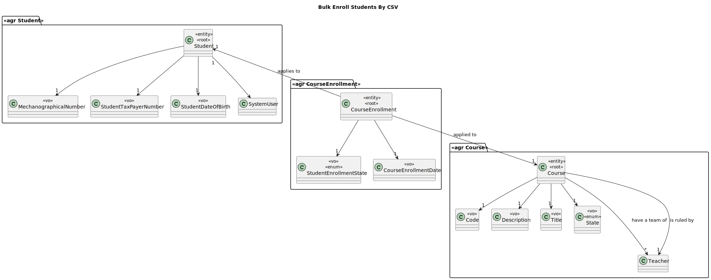
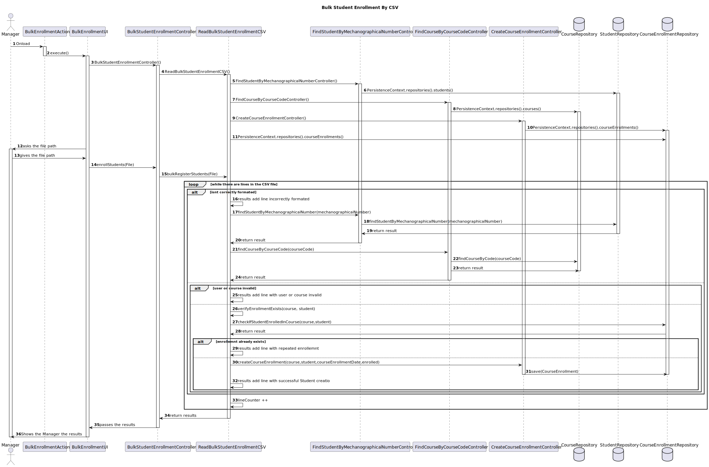

# US1007 —  As Manager, I want to bulk enroll students by importing their data using a csv file

## 1. Context

Courses have students enrolled in them.
The manager should be able to enroll students in bulk, by importing their data using a csv file.

## 2. Requirements

In order to bulk enroll students, the manager must be able to:

- Import a csv file with the students data.

### Client Clarifications
>Q:The students enrolled in bulk are students already registered? Or should they be registered and then enrolled after importing from the CSV file?

>A: I would argue that "enroll" is different from "register". A student to be enrolled in a course must be a registered user. As a manager I only want to enroll students. To be a student you must be registered as student. Enrolment does not include registration of users as students. FRC06 - Bulk Enroll Students in Course is basically and automated version of FRC07 - Request Enrollment in Course. FRC07 can only be executes by students (so they are already registered). I think you can infer that from the specification.

#### System Specifications Document

- FRC06 - Bulk Enroll Students in Course This can be made by importing a csv file
  with students. **Only managers are able to execute this functionality**


## 3. Analysis/Breakdown

In order to fulfill the requirements, the following use cases must be assured:
- Import students mechanographical number and course code from a csv file;
- Block repeated enrollments in the same course by the same student;

The creation of the enrolled students has already been implemented in the US1009 that is related to the approval and rejection of enrollment requests,
which in the case of acceptance the enrollment is created.

Which means that the work we need to do in this us is to verify there isnt any duplicates, the information is correct and then create the enrollments from the csv file.

### CSV File Format

As stated by the client, the csv file must have the identification of the students and courses.  
As the Mechanographical Number is enough to identify a student and equivalent to the courses is the course code, the csv file must have the Mechanographical Number of the students and course code of the desired course.  
It should also contain a header similiar to the one provided below:

````text
  Mechanographical Number            Course Code
**Mechanographical Number**        **Course Code**
**Mechanographical Number**        **Course Code**
````

The user must be already registered in the system, otherwise the import of the student will fail.
Ant the same applies to the courses, of the code is invalid the enrollment wont be created and a message will be displayed

### Importing the CSV File

The import of the csv file is done by the manager pasting the path to the desired file to prevent choosing the wrong file.

### Messages

As stated previously the program will display messages but not only in case of an error, it will let the user know which line created a new enrollment,
the ones that were already in the system, which were incorrectly formated or didnt have content and the lines that had invalid students or courses.

All different types of possible messages are showed below:

````Types of Messages
- Student enrollment successfully created on line X
- Student alread has an enrollment in that course on line X
- This CSV file isnt correctly formated or there is no content on line X
- Student or Course Invalid on line X
- There was a problem reading the file at line X
````

##### Notes:
- If the file does not have a header the first line will be skipped anyway;

## 4. Design

*In this sections, the team should present the solution design that was adopted to solve the requirement. This should include, at least, a diagram of the realization of the functionality (e.g., sequence diagram), a class diagram (presenting the classes that support the functionality), the identification and rational behind the applied design patterns and the specification of the main tests used to validade the functionality.*

### 4.1. Class Diagram



### 4.2. Sequence Diagram



*Notes:*
- The authorization verications all are being done and the diagram of those are on the authorization package
- We decided to not put on the diagram the verifications if the file path is empty, if the file exists and is a csv to simplify a little bit the diagram but those verifications are being done!

### 4.3. Applied Patterns

The applied patterns are:

DTO;
Controller;
Repository;
Domain.

### 4.4. Tests

//

## 5. Implementation

## ReadBulkStudentEnrollmentCSV
````
    public ArrayList<String> bulkRegisterStudents(File file){
        ArrayList<String> erros = new ArrayList<>();
        int contador = 2;
        if(!file.getName().toLowerCase().endsWith(".csv")){
            erros.add("The given file isnt a CSV.");
            return erros;
        }
        try {
            BufferedReader reader = new BufferedReader(new FileReader(file));
            String line = reader.readLine();
            while ((line = reader.readLine()) != null) {
                String[] argumentos = line.split("[,;]");
                if(argumentos.length == 0 || argumentos.length > 2){
                    erros.add("This CSV file isnt correctly formated or there is no content on line " + contador);
                }else{
                    try{
                        Student aluno = findStudent.findStudentByMechanographicalNumber(argumentos[0]);
                        Course curso = findCourse.findCourseByCourseCode(argumentos[1]);
                        if(!verifyEnrollmentExists(curso,aluno)){
                            enroll.createCourseEnrollment(curso,aluno, new CourseEnrollmentDate(LocalDate.now()), StudentEnrollmentState.ENROLLED);
                            erros.add("Student enrollment successfully created on line " + contador);
                        }else{
                            erros.add("Student alread has an enrollment in that course on line " + contador);
                        }
                    }catch (Exception e){
                        erros.add("Student or Course Invalid on line " + contador);
                    }
                }
                contador++;
            }
            return erros;
        }catch (Exception e){
            erros.add("There was a problem reading the file at line " + contador);
            return erros;
        }
````

## 6. Integration/Demonstration
   In this section the team should describe the efforts realized in order to integrate this functionality with the other parts/components of the system

It is also important to explain any scripts or instructions required to execute an demonstrate this functionality

## 7. Observations
   This section should be used to include any content that does not fit any of the previous sections.

The team should present here, for instance, a critical prespective on the developed work including the analysis of alternative solutioons or related works

The team should include in this section statements/references regarding third party works that were used in the development this work.


