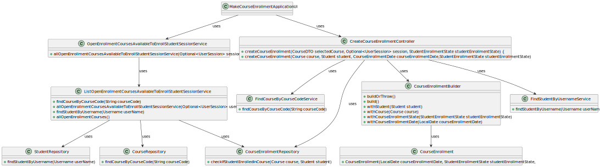

# US1008 —  As Student, I want to request my enrollment in a course.

## 1. Requirements

**US1008** - As Student, I want to request my enrollment in a course.

## 2. Analysis

### 2.1 Identifying problem

When analysing the problem, we confronted ourselves with the following questions:
* What are the course we will show the students 
* How will we persist the student's enrollment since we have a many to many relationship between student and course
* Can a student asks to enroll in a course that is already candidate to enroll
                                                                       
In order to implement this functionality it is necessary to:
* Verify the student already enrolled courses and what are the courses opened enroll and save in course the course state(open,closed...);
* Create a table responsible to save the course enrollment of a student;
### 2.2 Domain Excerpt

### 2.3 Unit tests - Business Rules Testing

**Test 1:** *Ensure no camp of course enrollment is null or empty*

## 3. Design

To solve this problem we first implemented a service responsible for getting the student enrolled courses. 
Then we implemented a service responsible for getting the courses opened for enrollment. 
And after those verifications we give the student to choose a course to enroll.
Then he persists his candidature in the course. 
Which if not successful we show him a message saying what could went wrong. 

### 3.1. Realization

* **Sequence Diagram**

* **Class Diagram**

### 3.2. Applied Patterns
* DTO;
* Persistence;
* Application;
* Controller;
* Builder;
* ApplicationService;
* DomainService;
* Domain;
* UI;
