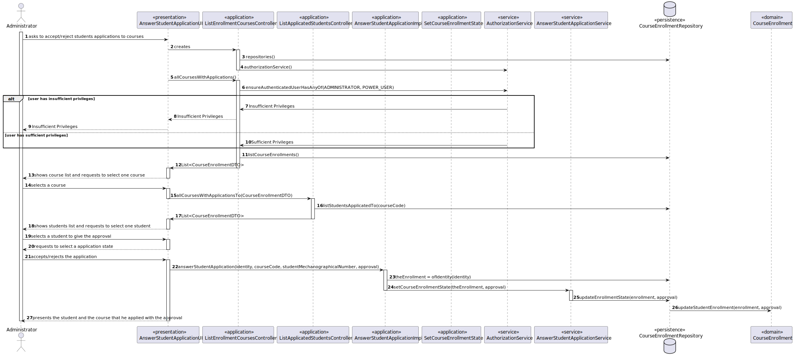

# US 1009

## 1. Context

This is an important use case for the system operation.

## 2. Requirements

**US1009** As Manager, I want to approve or reject students applications to courses

### Questions
> **Q** - We would like to know what are the requirements for a student to be accepted or rejected from an application  to a course.
>
> **A** - I think that decision can not be automatically taken by the system, it is a decision of the manager. The responsibility is of the manager according to course rules that ar out of the scope of this implementation. I think the system should only register the reason for the decision.

## 3. Analysis

*In this section, the team should report the study/analysis/comparison that was done in order to take the best design decisions for the requirement. This section should also include supporting diagrams/artifacts (such as domain model; use case diagrams, etc.),*

### 3.1 Domain Excerpt


## 4. Design

### 4.1. Realization


### 4.2. Class Diagram


### 4.3. Applied Patterns
The applied patters are:
 - DTO;
 - Service;
 - Controller;
 - Repository;
 - Domain.

### 4.4. Tests

```
@Test
    public void ensureCourseWorkFlowComply(){
        Course c1 = new Course("JAVA", "Java Collections Framework",
                "Java Collections Framework", CourseState.CLOSE, new Teacher("AMS",
                "21321312", LocalDate.of(1990,12,3), null));

        Assertions.assertThrows(IllegalArgumentException.class, c1::openCourseWithoutEnrollments);
        Assertions.assertThrows(IllegalArgumentException.class, c1::openCourseWithEnrollments);
        Assertions.assertThrows(IllegalArgumentException.class, c1::closeCourse);

        c1.openCourse();

        Assertions.assertThrows(IllegalArgumentException.class, c1::closeCourse);
        Assertions.assertThrows(IllegalArgumentException.class, c1::openCourse);
        Assertions.assertThrows(IllegalArgumentException.class, c1::openCourseWithoutEnrollments);

        c1.openCourseWithEnrollments();

        Assertions.assertThrows(IllegalArgumentException.class, c1::closeCourse);
        Assertions.assertThrows(IllegalArgumentException.class, c1::openCourse);
        Assertions.assertThrows(IllegalArgumentException.class, c1::openCourseWithEnrollments);

        c1.openCourseWithoutEnrollments();

        Assertions.assertThrows(IllegalArgumentException.class, c1::openCourse);
        Assertions.assertThrows(IllegalArgumentException.class, c1::openCourseWithEnrollments);
        Assertions.assertThrows(IllegalArgumentException.class, c1::openCourseWithoutEnrollments);

        c1.closeCourse();
    }
```

## 5. Implementation

## AnswerStudentApplicationImpl.java
```
@Override
    public CourseEnrollmentDTO answerStudentApplication(Integer identity, CourseDTO courseCode, StudentDTO studentMechanographicalNumber,
                                                        StudentEnrollmentState approval) {
        authz.ensureAuthenticatedUserHasAnyOf(ElearningRoles.ADMINISTRATOR,ElearningRoles.POWER_USER);

        var theEnrollment = repo.ofIdentity(identity)
                .orElseThrow(IllegalArgumentException::new);
        service.setCourseEnrollmentState(theEnrollment, approval);
        return theEnrollment.toDTO();
    }
```

## ListEnrollmentCoursesController.java
```
public Iterable<CourseEnrollmentDTO> allCoursesWithApplications(){
        authz.ensureAuthenticatedUserHasAnyOf(ElearningRoles.ADMINISTRATOR, ElearningRoles.POWER_USER);
        Iterable<CourseEnrollment> courses = repo.listCourseEnrollments();
        List<CourseEnrollmentDTO> result = new ArrayList<>();
        courses.forEach(a -> result.add(a.toDTO()));
        return result;
    }
```

## ListApplicatedStudentsController.java
```
	public Iterable<CourseEnrollmentDTO> allCoursesWithApplicationsTo(CourseEnrollmentDTO course){
        authz.ensureAuthenticatedUserHasAnyOf(ElearningRoles.ADMINISTRATOR, ElearningRoles.POWER_USER);
        Iterable<CourseEnrollment> students = repo.listStudentsApplicatedTo(course.getEnrollmentCourse().getCourseCode());
        List<CourseEnrollmentDTO> result = new ArrayList<>();
        students.forEach(a -> result.add(a.toDTO()));
        return result;
    }
```

## JpaCourseEnrollmentsRepository.java
```
    @Override
    public CourseEnrollment updateEnrollmentState(CourseEnrollment courseEnrollment, StudentEnrollmentState approval) {
        courseEnrollment.updateStudentEnrollment(approval);
        this.save(courseEnrollment);
        return courseEnrollment;
    }
```

## 6. Integration/Demonstration

## 7. Observations