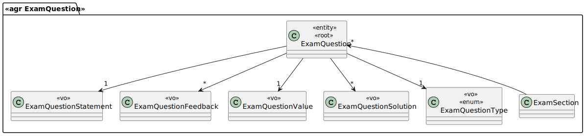
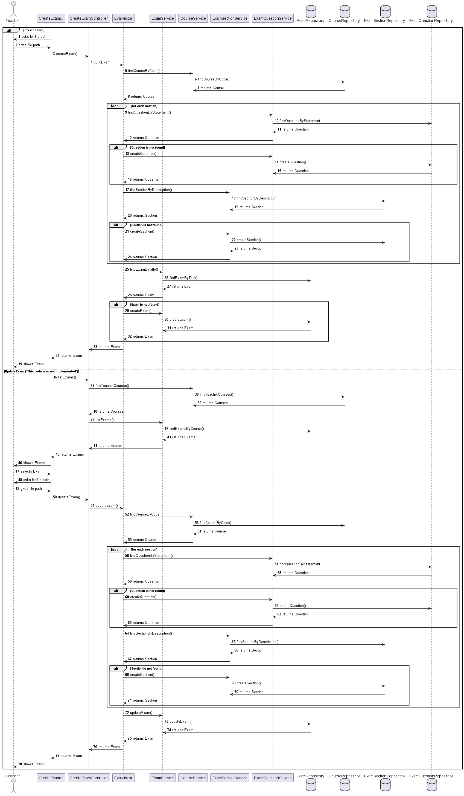

# US 2001

## 1. Requirements

**US2001** As Teacher, I want to create/update an exam

**Acceptance Criteria:** This includes the specification of the exam (i.e., its structure, in accordance with a grammar for exams that is used to validate the specification of the exam).
The support for exams (its design, feedback and grading) must follow specific technical requirements, specified in LPROG.
The ANTLR tool should be used.


## 2. Analysis


### 2.1 Identifying problem

This a US that relates 2 components: EAPLI + LPROG.

The EAPLI module is all DDD, i.e. UI, application, peristence and domain.
LPROG is an external module that validates a file (imported into the system by the EAPLI module), in this case an exam, to make sure that all the requirements for creating a valid exam are correct.

This use case is going to allow a teacher to add or update an already made exam .

EAPLI analyze the problem and creates the design for it.
LPROG analyzes the file inserted by the teacher and its content.

For the implementation of this us we need to ask the teacher which of the option he wants to use!
In case he chooses to add a new exam we need to ask him to send the file path that contains the exam so that it can be properly analized.

### Exam Example

```
Exam Title:Sou e mesmo Lindo
Exam Header:Exame de 10 minutos
Course Code:SEM02-JAVA

Section:1  
Question:O vicente venceu a partida?
Solution:True
Type:TRUE_OR_FALSE
Value:4
FeedBack:

Section:dois  
Question:Os melhores estudam no ____ toda a ____?
Options:ISEP|hora|
Solution:ISEP,hora
Type:MISSING_WORDS
Value:4
FeedBack:INCORRECT So no isep que encontras este nivel tao elevado

Question:Resistencia do ar?
Solution:43
Type:NUMERICAL
Value:4
FeedBack:Bom trabalho

Question:Quantas partidas o vicente venceu?
Options:Uma|Duas|Nenhuma|
Solution:3
Type:MULTIPLE_CHOICE
Value:4
FeedBack:Ele venceu todas

Question:Combina o que e verdade?
Options:O vicente sabe jogar|LOL|Nada|
Solution:1&2|
Type:MATCHING
Value:4
FeedBack:Ele venceu todas

Question:Funcao do pulmao?
Solution:Respirar e expirar|bombar|
Type:SHORT_ANSWER
Value:4
FeedBack:Ele venceu todas

InicialDate:2050-06-15 14:40
FinalDate:2050-06-15 14:50

```

### 2.2 Domain Excerpt


## 3. Design

The desing of this US e pretty simple, the teacher chooses if he wants to create one or update!

When he chooses to create a new exam we need to ask him to send the file path that contains the exam so that it can be properly analized.

When he chooses to update an exam we need to ask him to send the file path that contains the exam so that it can be properly analized and then ask him which exam he wants to update.

### 3.1. Realization


### 3.2. Applied Patterns
The applied patters are:
* DTO;
* Persistence;
* Application;
* Controller;
* Service;
* Domain;
* UI;