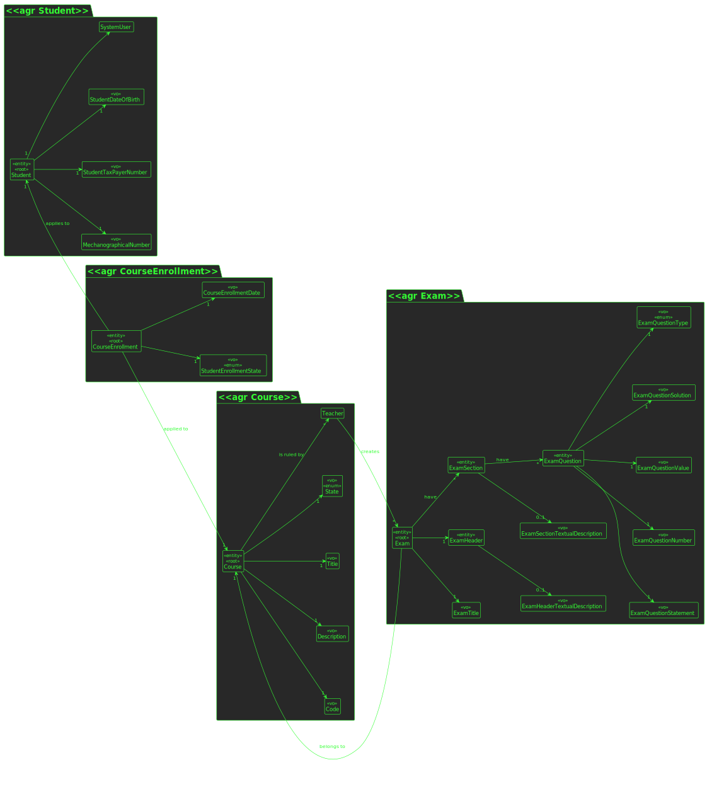
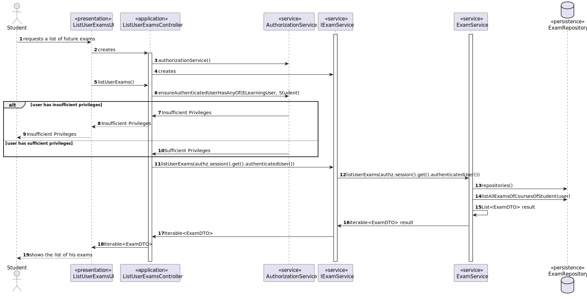
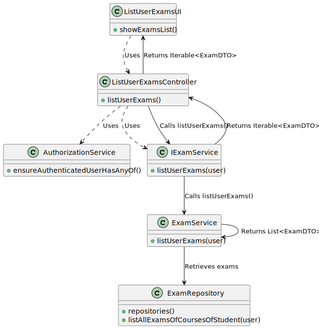

# US 1002

## 1. Requirements

**US2002** -  As Student, I want to view a list of my future exams

**Acceptance Criteria** - There is no specific acceptance criteria for this US
## 2. Analysis

### 2.1 Identifying problem
In order to implement this functionality it is necessary to:

* Regarding the exam events, this use case will allow the student to see a list of his future exams, regarding the courses that he is enrolled

### 2.2 Domain Excerpt

### 2.3 Unit tests - Business Rules Testing

**Test 1:** *Ensure course can't be null*

**Test 2:** *Ensure exams can't be null*

## 3. Design

To solve this problem it is necessary to retrieve a list of courses where the user is enrolled

After this, the system should take this list of courses and retrieve the exams of each course from the date the request is being made

The system should print to the user his future exams

### 3.1. Realization

* **Sequence Diagram**

* **Class Diagram**

### 3.2. Applied Patterns
The applied patters are:
* DTO;
* Persistence;
* Application;
* Controller;
* Service;
* Domain;
* UI;