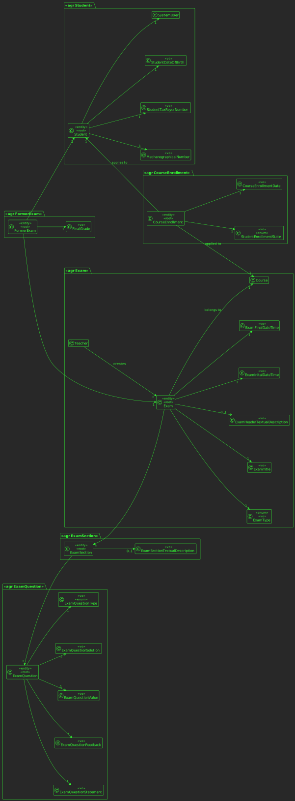

# US2004 —  As Student, I want to take an exam.

## 1. Requirements

**US2004** -  As Student, I want to take an exam.

**Acceptance Criteria** - A Student takes an exam and answer its questions.
At the end of the exam, the system should display the feedback and result (i.e., grade) of the exam.
The feedback and grade of the exam should be automatically calculated by a parser based on the grammar defined for exam

### Questions
> **Q** - When a student finished taking exam, will he want at some point review the exam and see his answers?
>
> **A** - This is not required.
> **Q** - Do we need to save the exam with the answers of a certain student to be able to show it later (if needed), or should we just calculate the final grade and show feedback for each question (if applicable)?
>
> **A** - Just calculate the final grade and show feedback for each question. Unless saving of the answers is required as a technical solution for some other aspect of your solution you do not need to save the answers.
> **Q** - Another question is about types of feedback: on-submission means on submission of a question or the whole exam?
>
> **A** - On submission of the whole exam.
> **Q** - Relativamente à funcionalidade de realizar um exame, mais concretamente à parte de mostrar a nota/feedback com a propriedade "after-closing" (referenciado na especificação do sistema), é esperado o aluno ser notificado mal a data de fecho do exame seja atingida ou pretende-se apenas que a nota possa ser visualizada a partir da funcionalidade correspondente à US2005/2006.
>
> **A** - Não consigo encontrar nenhuma referência a uma notificação depois da data de fecho do exame. O que vejo é que o sistema deve mostrar o resultado e o feedback no final do exame. A questão que se pode colocar é quando é que acontece o "fim do exame". Podemos entender que é quando o aluno submete o seu exame ou quando atingimos a data de fecho do exame ("close date"). Como cliente posso indicar que aceito a primeira interpretação, ou seja, assim que o aluno submete o seu exame, este recebe o feedback e nota (de forma sincrona). Penso que em termos de solução será a situação mais simples.
> **Q** - We would like to know if you wish that the grades are saved in the program database and would like for you to clarify the expected flow of both feedback and grade types.
>
> **A** - Regarding the first question, if you do not save the grades how do you implement the functionalities of FRE05 and FRE06? Regarding the second question, the ideia is to have something very similar to the Moodle platform. According to the specification "The system must also support the automatic production of feedback and grading for the answers given by students when they take the exam. Usually this is done at the end of the exam." So, the grade and the feedback should be provided only and the end of the exam. At the end of the exam, the system should display to the student the resulting grade of the exam as well as the grade and feedback for each question/answer.
> **Q** - When a student takes an exam, should we assume that he has only one attempt, or the number of attempts should be specified in the exam grammar?
>
> **A** - There is no mention regarding attempts in the specification, therefore there is no need to support that functionality.
## 2. Analysis

### 2.1 Identifying problem

When analysing the problem, we confronted ourselves with the following questions:
* How to implement the exam grammar?
* How to implement the most optimal way for the student answer the exam?
* Which exams should be available to the student?
* How will we evaluate the student's answers?
* How should the feedback be presented to the student?
* What parameters are important to persist in the database?
* What happens if the student doesn't finish the exam in time?

  In order to implement this functionality it is necessary to:
* Verify what are the available exams for the student, which are the exams that are applied to student enrolled courses
  and the time the student is asking to make an exam is after the exam's start date
  and time and before the exam's end date and time;
* Make a system able to show the student the exam's questions and permit answer them;
* Build a working grammar that accepts the student's expected inputted answers;
* Persist the intended feedback for each question on the creation of the exam and their solutions in order to 
compare them with the student's answers to evaluate his exam;
* The system must know the exam's end date and
  verify the time when the student submits the exam and if it is before the exam's end date and time;
* And finally concerning on the data that should be persisted, the exam's grade, the student and exam
  in order for the system to know what was the **Grade** of the **Student** in **Exam**.

### 2.2 Domain Excerpt

### 2.3 Unit tests - Business Rules Testing

**Test 1:** *Ensure no attributes are null*

**Test 2:** *Ensure grade is between 0 and 20*

## 3. Design

It was decided to divide this US in 2 parts:
* The first part is responsible for all the functionalities related for the student choosing the exam;
 for exporting the exam to the student, the importing of the exam and the verification of the exam submission;
* The third part is responsible for the exam's correction, calculation, showing the exam questions' feedback and grades
  and persisting the data for the database.

### 3.1. Realization

* **Sequence Diagram**

* **Class Diagram**

### 3.2. Applied Patterns
The applied patters are:
* DTO;
* Persistence;
* Application;
* Controller;
* Builder;
* ApplicationService;
* DomainService;
* Domain;
* UI;