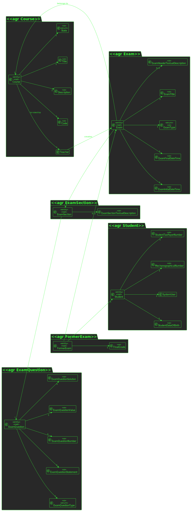
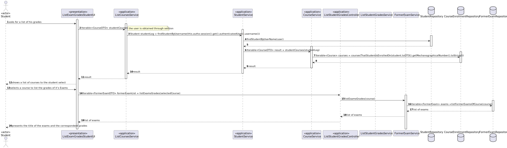
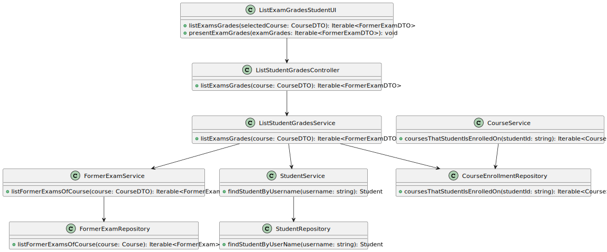

# US 2005

## 1. Requirements

**US2005** -  As Student, I want to view a list of my grades

**Acceptance Criteria** - This US doesn't have any specific criteria itself.

## 2. Analysis

### 2.1 Identifying problem

In this use case, the student wants to see a list of his grades, so it is important to make sure he is in at least one course, to make sure the list can be retrieved to show to the user

### 2.2 Domain Excerpt

### 2.3 Unit tests - Business Rules Testing

**Test 1:** *Ensure Grade Cant Be Null Or Empty*

**Test 2** *Ensure Student Cant Be Null Or Empty*

**Test 3** *Ensure Exam Cant Be Null Or Empty

## 3. Design

To solve this problem it is necessary to:
* Present a list of the courses to the student for him to show
* The Student must select a course
* After selecting the respective course, retrieve from the repository the exams he made
* After retrieving the exams, verify which one have a relation with the User that requested the grades

### 3.1. Realization

* **Sequence Diagram**

* **Class Diagram**

### 3.2. Applied Patterns
The applied patters are:
* DTO;
* Persistence;
* Application;
* Controller;
* Service;
* Domain;
* UI;

