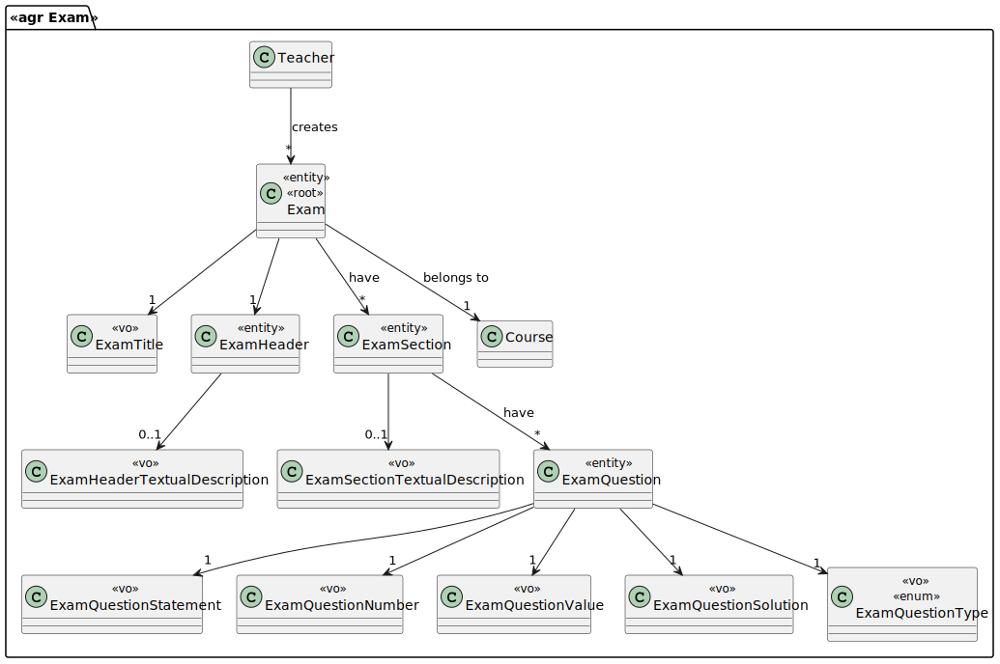
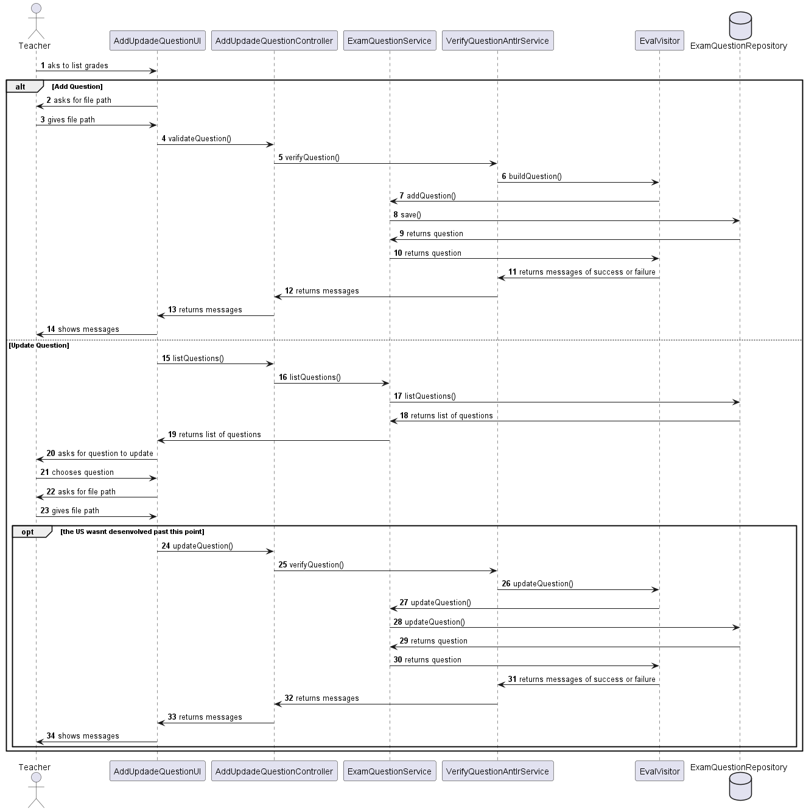

# US2007 —  As Teacher I want to add/update exam questions to a repository of exam questions to be used in automatic formative exams

## 1. Requirements

**Acceptance Criteria** - This includes only the specification of single questions to be used only in automatic formative exams, not on regular exams.
The support for exams (its design, feedback and grading) must follow specific technical requirements, specified in LPROG.
The ANTLR tool should be used.

## 2. Analysis

### 2.1 Identifying problem

This a US that relates 2 components: EAPLI + LPROG.

The EAPLI module is all DDD stuff, i.e. UI, application, peristence and domain.
LPROG is an external module that validates a file (imported into the system by the EAPLI module), in this case a question, to make sure that all the requirements for creating a valid question are correct.

This use case is going to allow a teacher to add or update an already made question to the repository of exam questions.

EAPLI analyze the problem and creates the design for it.
LPROG analyzes the file inserted by the teacher and its content.

For the implementation of this us we need to ask the teacher which of the option he wants to use! 
In case he chooses to add a new question we need to ask him to send the file path that contains the question so that it can be properly analized.

Here are a few examples:

````
MultipleChoiceQuestion - Qual alternativa e true? OP:Comer baratas OP:Comer cenouras OP:comer tudo RES:1 RES:2 - Cotacao: 2,5 ;

MissingWords - Sou um ___, ___ e ___ RES:Aluno RES:Do Isep RES:Choro em projetos de LAPR - Cotacao: 5 ;

MatchingQuestion - Junta os pares: OP:baratas OP:cenouras OP:bolo OP:canela RES:1 e 2 RES:3 e 4 - Cotacao: 2,5 ;

Short Answer - Tatico - 5 - Quantas vezes o vicente quinou numa noite?  A - Demasiadas para contar coitado Cotacao-5 B - Demasiadas Cotacao-3 C - Nenhuma Cotacao-0 ;

TrueFalse - O vicente venceu a partida? RES:True - Cotacao: 5 ;

MatchingQuestion - Junta os pares: OP:baratas OP:cenouras OP:bolo OP:canela RES:1&2 RES:3&4 - Cotacao: 5 ;
````

### 2.2 Domain Excerpt


## 3. Design

The desing of this US is the following, the teacher is shown the option of adding a new question or updating an already existing one:
If he chooses to add a new question he needs to provide a file with the question in the correct format.
Which is then tested to see if it is in the correct format.
If it is well formatted it creates a question and adds it to the repository showing a message to the teacher.

If he chooses to update a question he will be showed a list of questions to choose from.
After choosing one he will be asked to provide a file with the question of which will also be analized to check its formatation .
When the program finishes the analisys it will show the teacher sucess or failure of the update.   
    

### 3.1. Realization


### 3.2. Applied Patterns
The applied patters are:
* DTO;
* Persistence;
* Application;
* Controller;
* Service;
* Domain;
* UI;