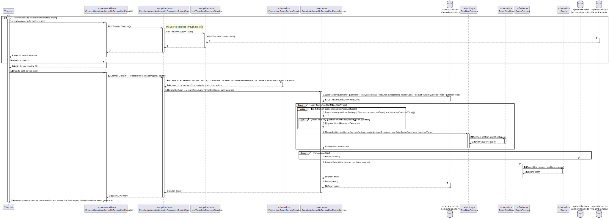

# US 2008


## 1. Requirements

**US 2008** - As Teacher, I want to create/update automatic formative exams

**Acceptance Criteria** - The specification of formative exams is similar to regular exams, but the user specifies the type of questions to be inserted in the sections instead of the specific questions. When generating the automatic formative exam, the system should randomly create the questions (without repetition on a given exam). Also, formative exams do not have open and close dates. Feedback and grades are only provided at the end of the exam.
The support for exams (its design, feedback and grading) must follow specific technical requirements, specified in LPROG.
The ANTLR tool should be used.

*Regarding this requirement we understand that it relates to the possibility of creating an automatic formative exam and
a validation is needed.*

## 2. Analysis

### 2.1 Identifying problem
Regarding the formative exam creation, this use case is divided in two components.
- EAPLI analyze the problem and creates the design for it;
- LPROG analyzes the text with a formative exam grammar that is going to validate text according to specific rules
  specified afterwards.

*It is very relevant to notice that this use case is only possible to achieve if the repository
contains the specified data already, in other words, if the user specify some type of question that it isn't persisted
in the database, it is impossible to create this automatic formative exam.*

### 2.2 Domain Excerpt


## 3. Design

### 3.1. Realization


### 3.2. Applied Patterns
The applied patterns were:
* ANTLR;
* UI;
* Controller;
* Repository;
* Factory;
* Service;
* Domain.

### 3.3. How to ...

#### 3.3.1 Create a formative exam
In order to create a valid formative exam there are a few rules and steps that must be followed.
Every formative exam must contain:
* Title;
* Header;
* Feedback;
* Grade;
* Section(s);
* Question type(s).

Notes: Every section must contain at least one question type.

Hereupon, this might be the formative exam aspect:
```
<Insert here the exam title>
feedback: [none/on-submission/after-closing]
grade: [none/on-submission/after-closing]
<Insert here the exam header>
<Insert here a section>
<Insert here question type(s)>
...
```
A simpler way to comprehend this rules is to see some tests/examples right away.

#### 3.3.2 Update a formative exam
In order to update a valid formative exam there are a few rules and steps that must be followed.
Every formative exam must contain:
* Title (an existing one);
* Section(s);
* Question type(s).

Notes: Every section must contain at least one question type.

Hereupon, this might be the aspect:
```
<Insert here the exam title>
<Insert here a section>
<Insert here question type(s)>
...
```

A simpler way to comprehend this rules is to see some tests/examples right away.


### 3.4. Grammatical Tests

In order to test the grammar there are some files that are going to validate and others that won't.


#### 3.4.1 Creating

**Test 1:** *Valid formative language.*

```
Programming Language Final Exam 2023
feedback: none
grade: none
Regular Expressions
multiple choice
short answer
numerical
State Machine
multiple choice
select missing words
true or false
matching
Bison and Flex
multiple choice
multiple choice
ANTLR
true or false
numerical

```

**Test 2:** *Invalid formative exam (every section needs at least 1 question type).*

```
Programming Language Final Exam 2023
feedback: none
grade: none
Regular Expressions
multiple choice
short answer
numerical
State Machine
multiple choice
select missing words
true or false
matching
Bison and Flex
multiple choice
multiple choice
ANTLR

```
**Test 3:** *Invalid formative exam (no title).*

```
feedback: none
grade: none
Regular Expressions
multiple choice
short answer
numerical
State Machine
multiple choice
select missing words
true or false
matching
Bison and Flex
multiple choice
multiple choice

```

**Test 4:** *Valid formative exam (a section can contain (1 or more) question types and every question type might be
the same (or not)).*

```
Programming Language Final Exam 2023
feedback: none
grade: none
Regular Expressions
multiple choice
short answer
numerical
State Machine
multiple choice
select missing words
true or false
matching
Bison and Flex
multiple choice
multiple choice
ANTLR
numerical
numerical
numerical
numerical
numerical

```

#### 3.4.1 Updating

**Test 1:** *Valid formative language.*

```
Programming Language Final Exam 2023
Regular Expressions
multiple choice

```

**Test 2:** *Invalid formative language (only title).*

```
Programming Language Final Exam 2023


```

**Test 2:** *Invalid formative language (there are no question types).*

```
Programming Language Final Exam 2023
Regular Expressions
ANTLR

```

