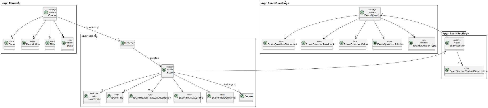

# US 2009

## 1. Requirements

**US2009** - As Student, I want to take an automatic formative exam.

**Acceptance Criteria** - A Student takes an automatic formative exam and answer its questions. Each time the system generates a new exam based on the database of questions and the specification of that exam.
At the end of the exam, the system should display the feedback and result (i.e., grade) of the exam.
The feedback and grade of the exam should be automatically calculated by a parser based on the grammar defined for exams structure.

## 2. Analysis

### 2.1 Identifying problem

In this use case, a student wants to take an automatic formative exam, in other words, the student must ask the 
system to take an automatic formative exam, then select one exam in the available(s) that might appear.
After this, a file is going to be saved in the student's computer containing the respective questions.
After taking the exam, the student should deliver the file, writing the path to it. After the delivery, the grade and 
the feedback is automatically calculated and shown to the student.

In this specific case, there isn't any delivery issues (like time) for being a formative exam.

### 2.2 Domain Excerpt

### 2.3 Unit tests - Business Rules Testing

**Test 1:** *.*

## 3. Design

This US had a similar implementation as US 2004, it had the same classes
applied the only difference was when calling the service responsible for getting 
the exams to do, it calls all the exams with exam type "FORMATIVE" to list to the student
and it doesn't have to validate the end and start date.

### 3.1. Realization

* **Sequence Diagram**

* **Class Diagram**

### 3.2. Applied Patterns
The applied patterns were:
* DTO;
* Controller;
* UI;
* Domain;
* Service;
* Persistence;
* ANTLR Visitor.