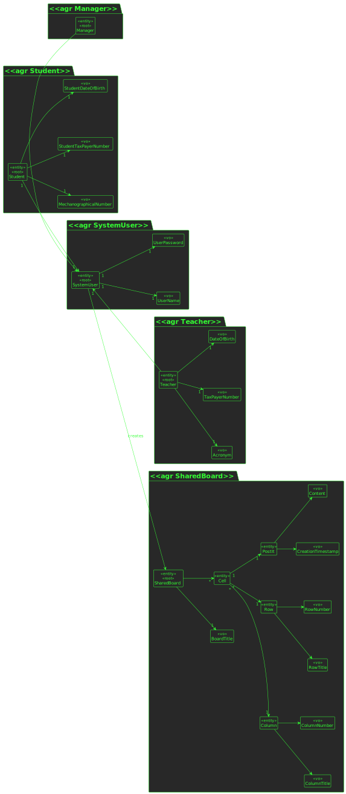

# US 3002

## 1. Context

This is a new task to do and is an important one.

## 2. Requirements

**US3002** As User, I want to create a board

## 3. Analysis

### 3.1 Domain Excerpt



## 4. Design

*In this sections, the team should present the solution design that was adopted to solve the requirement. This should include, at least, a diagram of the realization of the functionality (e.g., sequence diagram), a class diagram (presenting the classes that support the functionality), the identification and rational behind the applied design patterns and the specification of the main tests used to validade the functionality.*

### 4.1. Realization


### 4.2. Class Diagram


### 4.3. Applied Patterns
The applied patterns are:
- DTO;
- Service;
- Controller;
- Repository;

### 4.4. Tests
```
@Test
public void ensureSharedBoardTitleCantBeNullOrEmpty(){
Assertions.assertThrows(IllegalArgumentException.class, () -> new SharedBoard(null,
new SharedBoardCreationTimestamp().timestamp()));
Assertions.assertThrows(IllegalArgumentException.class, () -> new SharedBoard("",
new SharedBoardCreationTimestamp().timestamp())
);
}
```

*Test were not implemented because there was some issues creating the shared board*
## 5. Implementation

## CreateSharedBoardController.java
```
    private final AuthorizationService authz = AuthzRegistry.authorizationService();
    private final SharedBoardService service = new SharedBoardService();
    public SharedBoard createSharedBoard(String title, Integer rows, Integer columns){
        authz.ensureAuthenticatedUserHasAnyOf(ElearningRoles.ELEARNING_USER, ElearningRoles.STUDENT, ElearningRoles.TEACHER);

      final SharedBoard newSharedBoard = new SharedBoardBuilder()
              .withSharedBoardTitle(new SharedBoardTitle(title))
              .withSharedBoardRows(new SharedBoardRows(rows))
              .withSharedBoardColumns(new SharedBoardColumns(columns))
              .withSharedBoardUser(authz.session().get().authenticatedUser())
              .build();

        return service.createSharedBoard(newSharedBoard);
```

##SharedBoardService.java
```
private final SharedBoardRepository repo = PersistenceContext.repositories().sharedBoards();
    public SharedBoard createSharedBoard(SharedBoard newSharedBoard){
        return repo.save(newSharedBoard);
    }
```

## 6. Integration/Demonstration

*In this section the team should describe the efforts realized in order to integrate this functionality with the other parts/components of the system*

*It is also important to explain any scripts or instructions required to execute an demonstrate this functionality*

## 7. Observations

*This section should be used to include any content that does not fit any of the previous sections.*

*The team should present here, for instance, a critical prespective on the developed work including the analysis of alternative solutioons or related works*

*The team should include in this section statements/references regarding third party works that were used in the development this work.*
