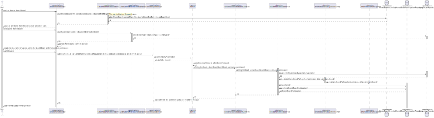

# US 3004

## 1. Requirements

**US3006** -  As User, I want to share a board

**Acceptance Criteria** - This functional part of the system has very specific technical requirements, particularly some
concerns about synchronization problems.
In fact, several clients will try to concurrently update boards.
As such, the solution design and implementation must be based on threads, condition variables and mutexes. Specific requ
irements will be provided in SCOMP.

### Questions
> **Q** - -As I'm sharing the board, I have to do which of these?
--give permissions to the users to Write on it immediately
--only share it with Read permissions and afterwards have the possibility to give the user write permissions
--only share it with Read permissions and lock those permissions as Read
>
> 
> **A** - When a user shares a board he/she must specify the users and, for each user, if the access is read or write

## 2. Analysis

### 2.1 Identifying problem
In order to implement this functionality it is necessary to:
* In this US, the main problem will the regarding the concurrent accesses
* In this solution it is used a mutex in order to guarantee mutual exclusion of every, hypothetical, thread that might
  be performing the same operation or any other that might interfere.
* Finally, concerning "The system should maintain a history/log of all the updates in the board.", everytime a post-it it
  's created, a new history/log starts, meaning that every detail needs to be persisted.

### 2.2 Domain Excerpt

### 2.3 Unit tests - Business Rules Testing

**Test 1:** *Ensure selected user can't be null*

**Test 2:** *Ensure board can't be null*

## 3. Design

To solve this problem it is necessary to create a request and send it to the server, after the connection is established,
the server receives data from the client, then attempts to share a board selected by the administrator of it with other users.

### 3.1. Realization

* **Sequence Diagram**

* **Class Diagram**

### 3.2. Applied Patterns
The applied patters are:
* DTO;
* Persistence;
* Application;
* Controller;
* Factory;
* Service;
* Domain;
* UI;
* Sockets;
* Multithreading;
* Mutex.