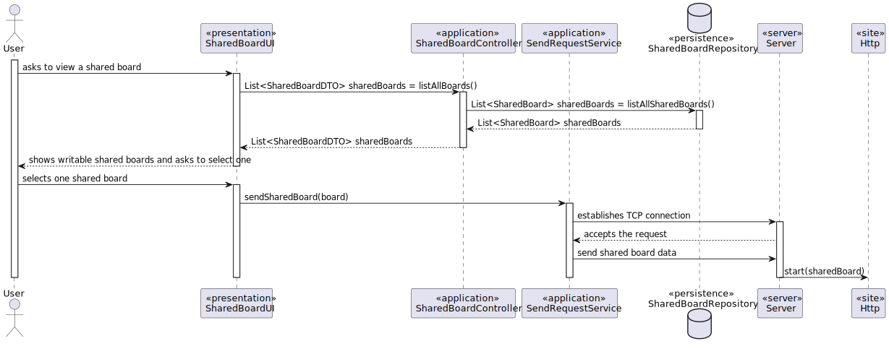

# US 3005

## 1. Requirements

**US3005** -  As User, I want to view, in real-time, the updates in the shared boards

**Acceptance Criteria** - This functional part of the system has very specific technical requirements, particularly some concerns about synchronization problems.
In fact, several clients will try to concurrently update boards.
As such, the solution design and implementation must be based on threads, condition variables and mutexes. Specific requirements will be provided in SCOMP.
The client app should implement an HTTP server to be able to generate the "views" of the boards. This should be done automatically, without the intervention of the users (i.e., without reload of the web page) by using AJAX.

### Questions
> **Q** - As a client, do you want us to persist post-its in the database or they can be available only while the server is running (deleted if the server stops)?
>
> **A** - For me the information regarding the shared boards may be available only during the shared board server execution.
However, if you are also developing the functionality "FRB08 - Archive Board", there should be some way to archive and the restore the board for "testing" purposes.

## 2. Analysis

### 2.1 Identifying problem
In order to implement this functionality it is necessary to:
* In this US, the main problem will the regarding the concurrent accesses
* In this solution it is used a mutex in order to guarantee mutual exclusion of every, hypothetical, thread that might
  be performing the same operation or any other that might interfere.
* Finally, concerning "The system should maintain a history/log of all the updates in the board.", everytime a post-it it
  's created, a new history/log starts, meaning that every detail needs to be persisted.

### 3. Realization

* **Sequence Diagram**

### 3.1. Applied Patterns
The applied patters are:
* DTO;
* Persistence;
* Application;
* Controller;
* Domain;
* UI;
* Sockets;
* Multithreading;
* Mutex.
* Http