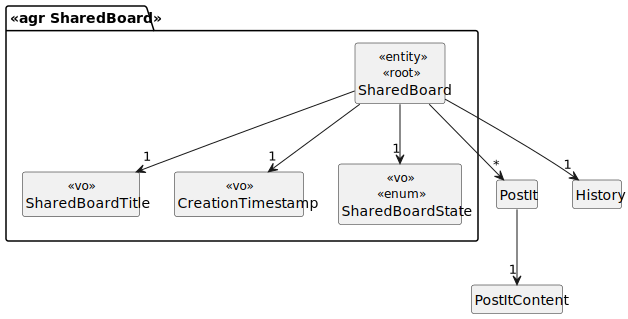
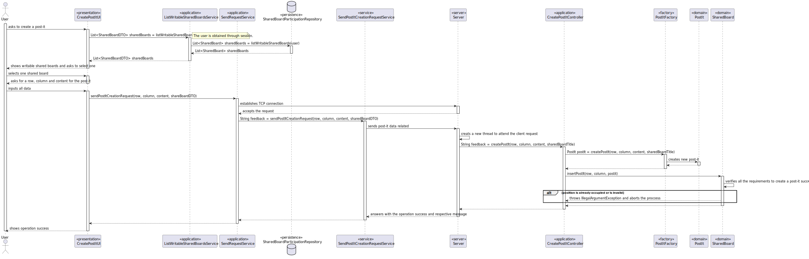

# US 3006

## 1. Requirements

**US3006** -  As User, I want to create a post-it on a board.

**Acceptance Criteria** - This functional part of the system has very specific technical requirements, particularly some
concerns about synchronization problems.
In fact, several clients will try to concurrently update boards.
As such, the solution design and implementation must be based on threads, condition variables and mutexes. Specific requ
irements will be provided in SCOMP.

### Questions
> **Q** - As a client, do you want us to persist post-its in the database or they can be available only while the server is running (deleted if the server stops)?
>
> **A** - For me the information regarding the shared boards may be available only during the shared board server execution.
However, if you are also developing the functionality "FRB08 - Archive Board", there should be some way to archive and the restore the board for "testing" purposes.

## 2. Analysis

### 2.1 Identifying problem

Regarding the shared board events, this use case is going to allow an user to create a post-it in a board that he has 
sufficient permission. Since the shared board is "shared" with multiple users, there are synchronization issues that 
need to be prevented. The resolution for this problem applies both EAPLI and SCOMP (external module):

EAPLI analyze the problem and creates the design for it.
SCOMP applies the multithreading and the respective solution for the intrinsic problems.

In order to implement this functionality it necessary to:
* Verify if the row and the column is already occupied by other post-it and notify the users from a shared
  board when the server commits a post-it;
* Verify if the row and column indicated by the user are valid;
* Finally, concerning "The system should maintain a history/log of all the updates in the board.", everytime a post-it it
  's created, a new history/log starts, meaning that every detail needs to be persisted.

### 2.2 Domain Excerpt

### 2.3 Unit tests - Business Rules Testing

**Test 1:** *Ensure post-it content can't be null*

**Test 2:** *Ensure post-it content can't be empty*

**Test 3:** *Ensure post-it row can't be negative*

**Test 4:** *Ensure post-it row can't be superior to the maximum defined in configuration file*

**Test 5:** *Ensure post-it column can't be negative*

**Test 6:** *Ensure post-it column can't be superior to the maximum defined in configuration file*

**Test 7:** *Ensure post-it can't be posted in a position already occupied*

## 3. Design

To solve this problem it is necessary to create a request and send it to the server, after the connection is established,
the server receives data from the client, then attempts to create the post-it (with all the due verification through a
service and domain). A feedback is returned to the client with the respective success. 

There is a configuration file located on *"elearning.core/src/main/resources/application.properties.sample".* where the
  max size for both rows and columns are defined as *"row_max=20"* and *"col_max=10"*

All post-it related information is only saved while the server is up, meaning this that is managed in memory and nothing
is persisted.

There is also a "cell controller" that only allows the creation of the respective post-it, meaning this that every cell 
has a distinct control of each other, also meaning that creating, at the same time, post-its in a different positions 
doesn't prevent from each other. There is a distinct exclusive enviroment for each position of the shared board.

### 3.1. Realization

### 3.2. Applied Patterns
The applied patters are:
* DTO;
* Persistence;
* Application;
* Controller;
* Service;
* Factory;
* Domain;
* UI;
* Sockets;
* Multithreading;
* Mutex.