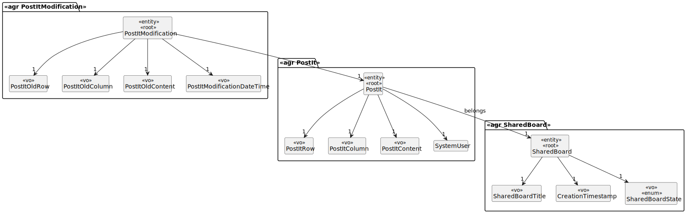
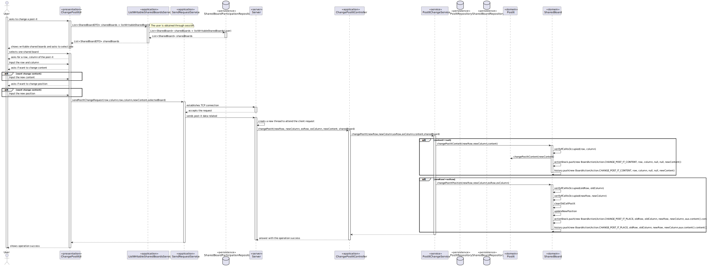

# US 3007

## 1. Requirements

**US3007** -  As User, I want to change a post-it

**Acceptance Criteria** - This functional part of the system has very specific technical requirements, particularly some concerns about synchronization problems.
In fact, several clients will try to concurrently update boards.
As such, the solution design and implementation must be based on threads, condition variables and mutexes. Specific requirements will be provided in SCOMP.

### Questions
> **Q** - As a client, do you want us to persist post-its in the database or they can be available only while the server is running (deleted if the server stops)?
>
> **A** - For me the information regarding the shared boards may be available only during the shared board server execution.
However, if you are also developing the functionality "FRB08 - Archive Board", there should be some way to archive and the restore the board for "testing" purposes.

## 2. Analysis

### 2.1 Identifying problem

Regarding shared board events, this use case will allow a user to mode a posit already created on the shared board. Since the shared board is "shared" with multiple users, there are synchronization issues that need to be prevented. The resolution for this problem applies both EAPLI and SCOMP (external module):

EAPLI analyze the problem and creates the design for it.
SCOMP applies the multithreading and the respective solution for the intrinsic problems.

In order to implement this functionality it necessary to:
* Ask the user for the PostIt of which Shared Board he wants to change
* Check if the line and column indicated by the user are valid;
* Finally, regarding "The system should keep a history/log of all updates to the board.", every time a post-it
  is changed, a new history/log is started, which means all details need to be maintained.

### 2.2 Domain Excerpt

### 2.3 Unit tests - Business Rules Testing

## 3. Design

To solve this problem it is necessary to create a request and send it to the server, after the connection is established,
the server receives the data from the client, then tries to change the post-it (with all due verification via a
service and domain).

There is a configuration file located at *"elearning.core/src/main/resources/application.properties.sample".* where the
the maximum size for rows and columns is defined as *"row_max=20"* and *"col_max=10"*

All information related to the post-it is only saved while the server is active, that is, this is managed in memory and nothing
is persisted.

There is also a "cell controller" that only allows changing the respective post-it, that is, each cell
have a control distinct from each other, also meaning that altering/creating post-its at different positions at the same time
does not preclude one from the other. There is a distinct unique environment for each shared board position.

### 3.1. Realization

### 3.2. Applied Patterns
The applied patters are:
* DTO;
* Persistence;
* Application;
* Controller;
* Service;
* Domain;
* UI;
* Sockets;
* Multithreading;
* Mutex.