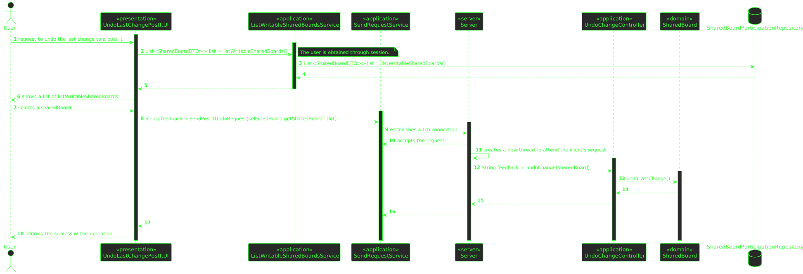
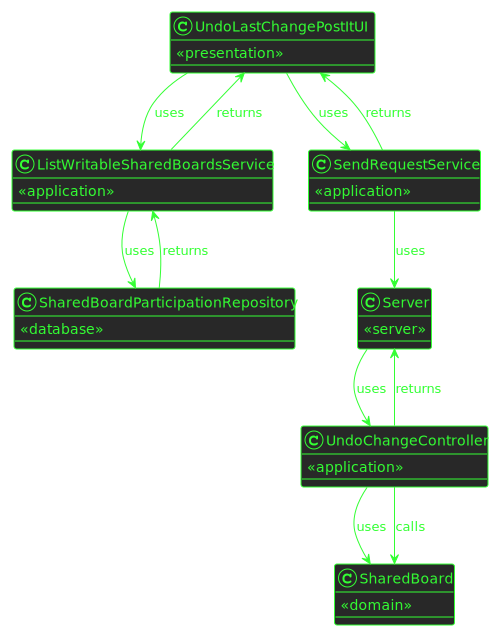

# US 3008

## 1. Requirements

**US3008** -  As User, I want to undo the last change in a post-it.

**Acceptance Criteria** - This functional part of the system has very specific technical requirements, particularly some concerns about synchronization problems.
In fact, several clients will try to concurrently update boards.
As such, the solution design and implementation must be based on threads, condition variables and mutexes. Specific requirements will be provided in SCOMP.

## 2. Analysis

### 2.1 Identifying problem
In order to implement this functionality it is necessary to:
* In this solution it is used a mutex in order to guarantee mutual exclusion of every, hypothetical, thread that might
  be performing the same operation or any other that might interfere.

### 2.2 Domain Excerpt

### 2.3 Unit tests - Business Rules Testing

**Test 1:** *Ensure sharedBoard title can't be null or empty*

**Test 2:** *Ensure UndoPostIt works successfully*

**Test 3:** *Ensure UndoPostIt doesn't work if there is no last change*

## 3. Design

To solve this problem it is necessary to 
* Present a list of sharedBoard to the user, from the sharedBoardParticipation repository

* Create a request and send it to the server, after the connection is established,
the server receives data from the client, then attempts to undo the last change of a post it (with all the due verification through a
service and domain). A feedback is returned to the client with the respective success.

### 3.1. Realization

* **Sequence Diagram**

* **Class Diagram**

### 3.2. Applied Patterns
The applied patters are:
* DTO;
* Persistence;
* Application;
* Controller;
* Service;
* Domain;
* UI;
* Sockets;
* Multithreading;
* Mutex.