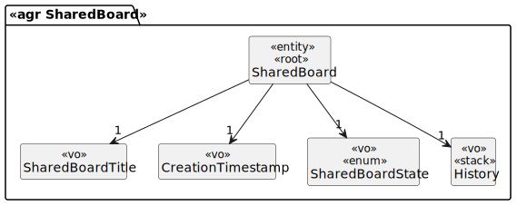

# US 3009

## 1. Requirements

**US3009** -  As User, I want to view the history of updates on a board

**Acceptance Criteria** - This functional part of the system has very specific technical requirements, particularly some concerns about synchronization problems.
In fact, several clients will try to concurrently update boards.
As such, the solution design and implementation must be based on threads, condition variables and mutexes. Specific requirements will be provided in SCOMP.

## 2. Analysis

### 2.1 Identifying problem

Regarding Shared Board events, this use case will allow viewing the history of a Shared Board. Since the shared frame is "shared" with multiple users, there are synchronization issues that need to be avoided. The resolution for this problem applies to both EAPLI and SCOMP (external module):

EAPLI analyze the problem and creates the design for it.
SCOMP applies the multithreading and the respective solution for the intrinsic problems.

In order to implement this functionality it necessary to:
* Ask the user for the shared Board tha he want to view history
* Show the data on console

### 2.2 Domain Excerpt

### 2.3 Unit tests - Business Rules Testing

### 3. Realization

### 3.2. Applied Patterns
The applied patters are:
* DTO;
* Persistence;
* Application;
* Controller;
* Service;
* Domain;
* UI;
* Sockets;
* Mutex.