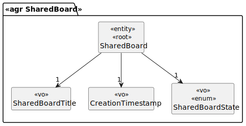
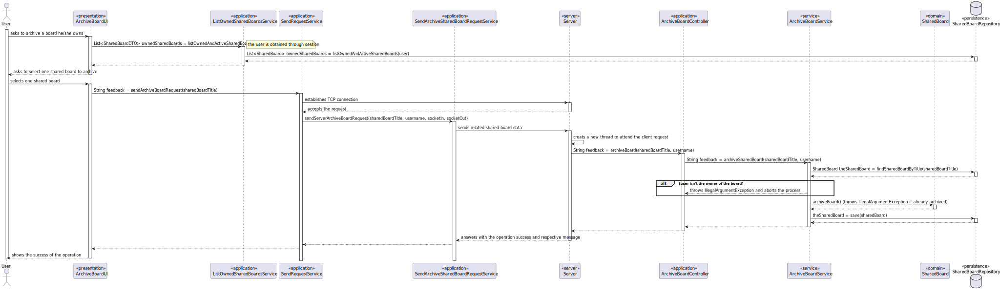

# US 3010

## 1. Requirements

**US3010** - As User, I want to archive a board I own.

**Acceptance Criteria** - This functional part of the system has very specific technical requirements, particularly some
concerns about synchronization problems.
In fact, several clients will try to concurrently update boards.
As such, the solution design and implementation must be based on threads, condition variables and mutexes.
Specific requirements will be provided in SCOMP.

## 2. Analysis

### 2.1 Identifying problem

Regarding the shared board events, this use case is going to allow an user to archive a board he/she owns.
Since the shared board is "shared" with multiple users, there are synchronization issues that need to be prevented.
The resolution for this problem applies both EAPLI and SCOMP (external module):
- EAPLI analyze the problem and creates the design for it.
- SCOMP applies the multithreading and the respective solution for the intrinsic problems.

This use case raises some troubles related with race conditions, meaning this that data can be wrongly read or even 
messed up. Each operation interferes with every operation.

### 2.2 Domain Excerpt

### 2.3 Unit tests - Business Rules Testing

**Test 1:** *Ensure shared board is archivable.*

**Test 2:** *Ensure shared board it's not archivable if already archived.*

**Test 3:** *Ensure shared board is restorable.*

**Test 4:** *Ensure shared board it's not restorable if already active.*

## 3. Design
In order to accomplish this use case, according to our design, a simple state change is more than sufficient.

Archive a board implies an atomic operation, meaning this, that must be performed in an exclusive environment.
In this solution it is used a mutex in order to guarantee mutual exclusion of every, hypothetical, thread that might
be performing the same operation or other that might interfere.
### 3.1. Realization

### 3.2. Applied Patterns
The applied patters are:
* DTO;
* Persistence;
* Application;
* Controller;
* Service;
* Domain;
* UI;
* Socket;
* Multithreading;
* Mutex.

