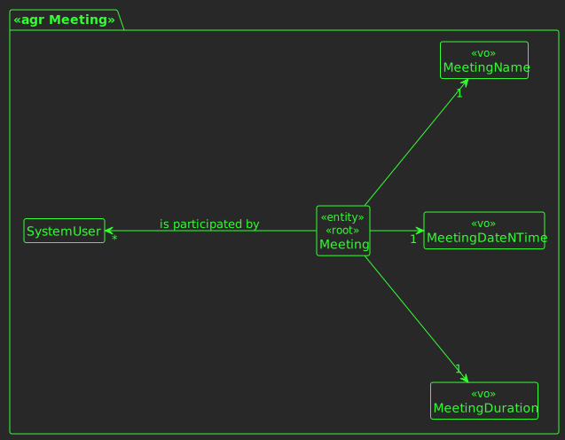

# US 4001

## 1. Requirements

*In this section you should present the functionality that is being developed, how do you understand it, as well as possible correlations to other requirements (i.e., dependencies).*

**US4001** -  As User, I want to schedule a meeting.

**Acceptance Criteria** - The system must check if all participants are available and send invitations to participants.

*Regarding this requirement we understand that it relates to every other event that a guest may have (meeting, lecture 
or extra lecture) and it is mandatory to tell the meeting creator the availability of each user that he wants to invite.*

## 3. Analysis

*In this section, the team should report the study/analysis/comparison that was done in order to take the best design decisions for the requirement. This section should also include supporting diagrams/artifacts (such as domain model; use case diagrams, etc.),*

### 3.1 Domain Excerpt


## 4. Design

*In this sections, the team should present the solution design that was adopted to solve the requirement. This should include, at least, a diagram of the realization of the functionality (e.g., sequence diagram), a class diagram (presenting the classes that support the functionality), the identification and rational behind the applied design patterns and the specification of the main tests used to validade the functionality.*

### 4.1. Realization


### 4.2. Applied Patterns
The applied patters are:
 - DTO;
 - Service;
 - Controller;
 - Repository;
 - Domain.
### 4.3. Tests

**Test 1:** *Verifies if the meeting name is null or empty.*

```
@Test
    public void ensureMeetingNameCantBeNullOrEmpty(){
        Assertions.assertThrows(IllegalArgumentException.class, () -> new Meeting(60
                , LocalDateTime.of(LocalDate.of(2024, 10, 10), LocalTime.of(10, 0))
                , ""
                , null));

        Assertions.assertThrows(IllegalArgumentException.class, () -> new Meeting(60
                , LocalDateTime.of(LocalDate.of(2024, 10, 10), LocalTime.of(10, 0))
                , null
                , null));
    }
```
**Test 2:** *Verifies if the meeting duration is null, empty, negative or exceeds a day.*
```
    @Test
    public void ensureMeetingDurationCantBeNullNegativeOrLongerThanADay(){
        Assertions.assertThrows(IllegalArgumentException.class, () -> new Meeting(-50
                , LocalDateTime.of(LocalDate.of(2024, 10, 10), LocalTime.of(10, 0))
                , "Test"
                , null));

        Assertions.assertThrows(IllegalArgumentException.class, () -> new Meeting(24*60
                , LocalDateTime.of(LocalDate.of(2024, 10, 10), LocalTime.of(10, 0))
                , "Test"
                , null));

        Assertions.assertThrows(IllegalArgumentException.class, () -> new Meeting(null
                , LocalDateTime.of(LocalDate.of(2024, 10, 10), LocalTime.of(10, 0))
                , "Test"
                , null));
    }
```
**Test 3:** *Verifies if the meeting date and time is null or before the actual date and time.*
```
    @Test
    public void ensureMeetingDateTimeCantBeNullOrBeforeActualDateTime(){
        Assertions.assertThrows(IllegalArgumentException.class, () -> new Meeting(15
                , null
                , "Test"
                , null));

        Assertions.assertThrows(IllegalArgumentException.class, () -> new Meeting(15
                , LocalDateTime.of(LocalDate.of(2022, 10, 10), LocalTime.of(10, 0))
                , "Test"
                , null));
    }
````