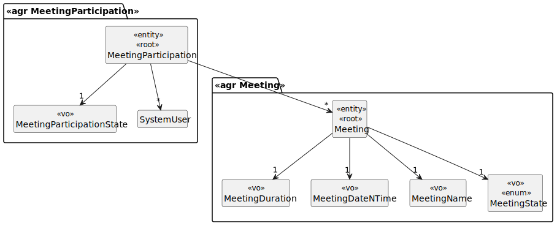
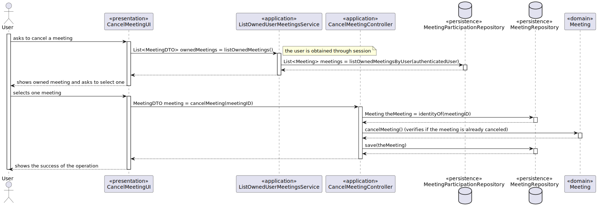

# US 4002

## 1. Requirements

**US4002** - As User, I want to cancel a meeting.

## 2. Analysis

### 2.1 Identifying problem

In this use case, an user wants to cancel a meeting that he/she owns, in other words, a meeting state must be modified.
It is important to highlight that a canceled meeting can't be canceled.

### 2.2 Domain Excerpt

### 2.3 Unit tests - Business Rules Testing

**Test 1:** *Verifies if the meeting name is null or empty.*

**Test 2:** *Verifies if the meeting duration is null, empty, negative or exceeds a day.*

**Test 3:** *Verifies if the meeting date and time is null or before the actual date and time.*

**Test 4:** *Verifies if the meeting is cancelable.*

**Test 5:** *Verifies if the meeting is already canceled it can't be canceled.*

**Test 6:** *Verifies if the meeting already occurred it can't be canceled.*

## 3. Design

The user selects one meeting (only the ones that he/she owns) and confirms that he/she wants to cancel the meeting.

### 3.1. Realization

### 3.2. Applied Patterns
 The applied patterns were:
 * DTO;
 * Service;
 * Controller;
 * UI;
 * Domain;
 * Persistence.