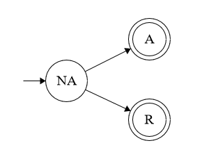

# US 4003

## 1. Requirements

**US4003** - As User, I want to accept or reject a meeting request.

### Questions
> **Q** - Em relação a esta US deveríamos simplesmente considerar os "meeting request" que não foram aceites ou rejeitados?
Um "meeting request" que já foi aceite ou rejeitado poderá ser alterado, depois?
>
> **A** - Não sei se discutiu o assunto na aula OT presencial, mas a intenção nesta US é fazer exactamente o que está descrito: aceitar ou rejeitar um pedido de reunião. A decisão é tomada uma única vez pelo utilizador.

## 2. Analysis

### 2.1 Identifying problem
Regarding the meeting events, this user story is going to allow an user to accept/refuse a meeting invitation.
A meeting can be only accepted or rejected, is a simple requirement that is implied.

In other words, the workflow must be: "No answer -> Accepted" or "No answer -> Rejected".*

### 2.2. State Machine
This is a state machine that explains the usual workflow related to the meeting acceptance, where:

* NA -> No answer;
* A -> Accepted;
* R -> Refused.

### 2.3 Domain Excerpt

### 2.4 Unit tests - Business Rules Testing

**Test 1:** *Ensure meeting invitation is acceptable.*

**Test 2:** *Ensure meeting invitation is refusable.*

**Test 3:** *Ensure invitation can't be accepted after being answered.*

**Test 4:** *Ensure invitation can't be refused after being answered.*

**Test 5:** *Ensure participation state can't be null.*

## 3. Design
To solve this use case problem, a simple workflow is followed (review 2.2), there are verifications making sure that 
the implementation accords with what is wanted. Hereupon, there are 2, successful, possible cases:
  * Acceptance case - The user wants to accept the invitation and notifies the system about it.
  * Denial case - The user doesn't want to accept the invitation and notifies the system about it.
 

### 3.1. Realization

### 3.2. Applied Patterns

The applied patterns were:
 * DTO;
 * UI;
 * Application;
 * Persistence;
 * Service;
 * Domain.
