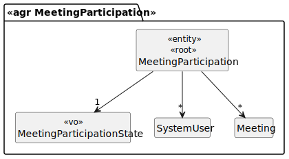
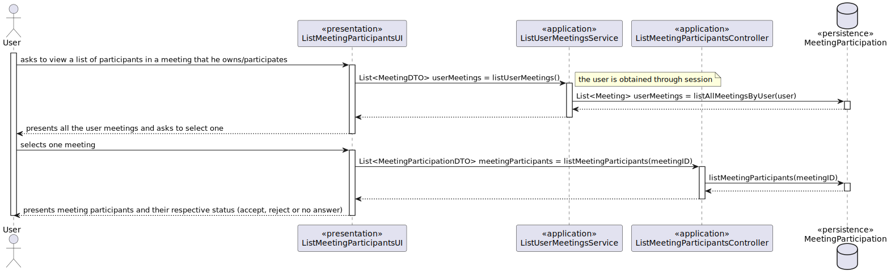

# US 4004

## 1. Requirements

**US4004** -  As User, I want to view a list of participants in my meeting and their status (accept or reject).

### Questions
> **Q** - Relativamente a esta user story, o ficheiro excel providenciado refere o seguinte:
"As User, I want to view a list of participants in my meeting and their status (accept or reject)."
Aqui, pelo menos a meu ver, o termo "my meeting" parece sugerir que esta funcionaliade apenas se a aplica a meetings que o utilizador criou (i.e. se um User não for owner de uma meeting não puderá ver os seus participantes).
No entanto, no documento de especificação, o seguinte é dito:
> The system displays the lists of participants in a meeting and the response status (accept or reject meeting).
O que não discrimina se esta funcionalidade deve estar disponível a todos os participantes ou apenas ao criador.
A meu ver, a alternativa que parece fazer mais sentido seria, de facto, qualquer utilizador poder ver a lista de participantes de uma meeting, desde que pertença à mesma; no entanto, faço-lhe esta pergunta para me certificar de que a feature que vai ser implementada realmente corresponde àquilo que o cliente pretende.
Aproveito ainda para lhe perguntar se a data da ocorrência da meeting possui alguma importância no que diz respeito a este caso de uso; isto é, o utilizador deve poder selecionar a meeting que pretende ver os participantes mesmo que esta já tenha ocorrido (e terminado), ou apenas aquelas que estão/irão decorrer é que possuem relevância?
>
> **A** - Relativamente à primeira questão faz sentido a sua segunda interpretação, ou seja, o que está no documento de especificação está correto e reflete o que o cliente deseja. Ou seja, deve ser possível qualquer utilizador participante consultar os outros participantes em reuniões na qual ele também é participante.
Relativamente à segunda questão, do ponto de vista do cliente faz sentido também ver reuniões que ocorreram no passado.
>

> **Q** - Relativamente a esta user story, o ficheiro excel providenciado refere o seguinte:
> "As User, I want to view a list of participants in my meeting and their status (accept or reject)"
>Isso significa que só devem ser apresentados os participantes que possuam status "accept" or "reject" (portanto não 
>seriam mostrados os participantes com status "pending" ou "owner" por exemplo), ou serve apenas como exemplo para se entender o que refere quando se fala no status?
>
> **A** -  A ideia é que apareçam todos os participantes e o seu estado. Suponho que quem ainda não respondeu não terá nada no estado ou "pending" ou "unknown".
## 2. Analysis

### 2.1 Identifying problem
Regarding the meeting events, this use case is going to allow an user to understand the invited users answers from an
own meeting and also the ones that he/she participates.

### 2.2 Domain Excerpt

### 2.3 Unit tests - Business Rules Testing
**Test 1:** *Ensure meeting invitation is acceptable.*

**Test 2:** *Ensure meeting invitation is refusable.*

**Test 3:** *Ensure meeting invitation can't be accepted after being answered.*

**Test 4:** *Ensure meeting invitation can't be refused after being answered.*

## 3. Design
The user selects one meeting that he owns or participates (accepted the invitation) and is presented
a view with all people associated to that meeting with the respective state (owner, participant, etc...)

### 3.1. Realization

### 3.2. Applied Patterns
The applied patters are:
 * DTO;
 * Persistence;
 * Application;
 * Service;
 * UI.

